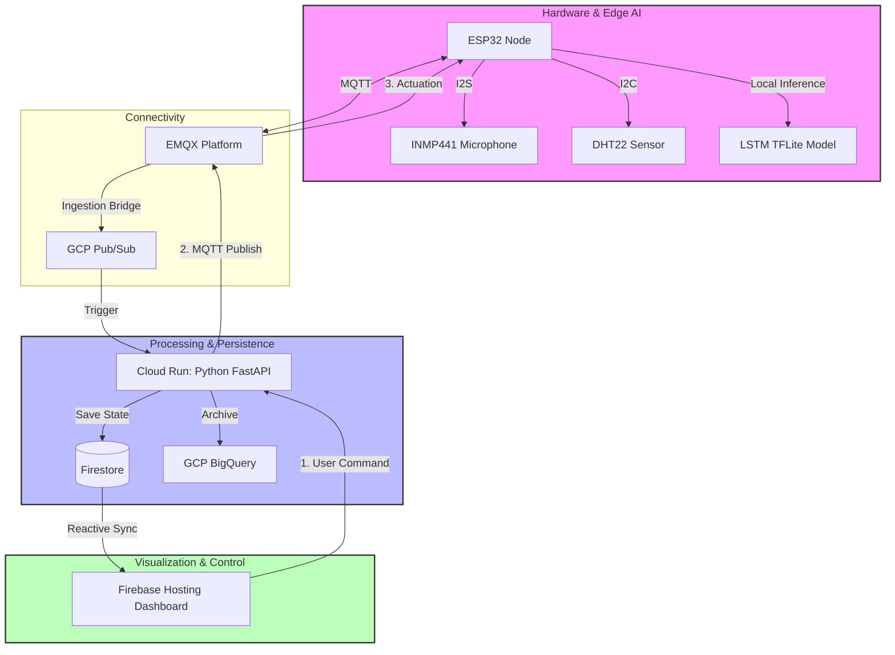
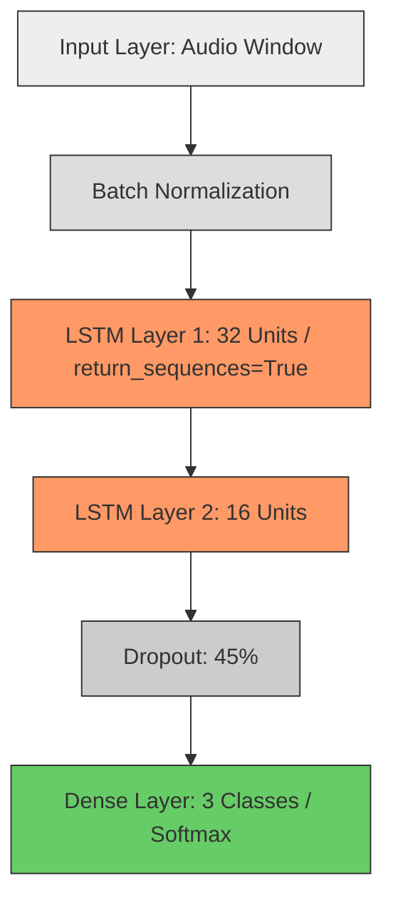

# IoT Hackathon Center: Intelligent Acoustic Inference & Environmental Safety System

## Abstract
This project presents an end-to-end **Industrial IoT (IIoT)** ecosystem designed for large-scale indoor event management. The system integrates **Edge Artificial Intelligence** for acoustic scene classification with real-time environmental telemetry to mitigate risks such as thermal stress and overcrowding. By deploying a custom **Long Short-Term Memory (LSTM)** neural network onto **ESP32** microcontrollers using **TensorFlow Lite Micro**, we achieve local inference with low power consumption and high privacy. Data is orchestrated through an asynchronous cloud architecture involving **MQTT**, **GCP Pub/Sub**, and **Cloud Run**, culminating in a high-fidelity reactive dashboard with sub-second latency.

## Keywords
Edge AI, TinyML, ESP32, LSTM, Acoustic Scene Classification (ASC), Thermal Stress, Heat Index, Google Cloud Platform, Firebase, MQTT, Real-Time Analytics.

## Introduction
Managing high-density indoor environments requires monitoring both physical safety and activity context. This system addresses "Context Blindness" and "Thermal Stress" by performing intelligent local inference. The ESP32 processes audio internally, ensuring participant privacy by only transmitting classification metadata.

## System Architecture

The following diagram details the event-driven data flow and the interaction between the Edge nodes and the Cloud infrastructure:



---

## Edge AI: Deep Learning Model Architecture

The system uses a Recurrent Neural Network (RNN) based on **LSTM** layers, specifically optimized for temporal audio feature analysis on low-power hardware.

### Neural Network Visualization


### Model Specifications (Keras Implementation)
The model was trained and quantized using the following structure:
```python
models.Sequential([
    layers.Input(batch_shape=(None, 1248, 1)), # Example window size
    layers.BatchNormalization(),
    layers.LSTM(32, return_sequences=True, unroll=True),
    layers.LSTM(16, unroll=True),
    layers.Dropout(0.45),
    layers.Dense(3, activation='softmax')
])
```
*   **Unrolled LSTM**: Enabled `unroll=True` to eliminate loop overhead, crucial for **TensorFlow Lite Micro** compatibility on ESP32.
*   **Quantization**: Converted to **Full INT8** to match the ESP32's fixed-point processing capabilities.

---

## Results: Technical Specifications & Performance

### 1. Classification Metrics
*   **Dataset**: Consolidated ESC-50 corpus, augmented via noise injection and temporal shifts.
*   **Accuracy**: **~74-76%** on validation.
*   **Precision/Recall by Class**:
    | Class | Recall | Diagnosis |
    | :--- | :--- | :--- |
    | DEEP_FOCUS | 78% | Detection of typing and constant mechanical noise. |
    | HIGH_ENGAGEMENT| 72% | Captures speech followed by energy spikes (applause). |
    | ROOM_EMPTY | 90% | Excellent performance in quiet environments. |

----


-----


----


----

### 2. Thermal Stress Logic
Risk evaluation based on the Heat Index (HI) standards:

| Alert Level | Diagnosis | System Action |
| :--- | :--- | :--- |
| **NORMAL** | Optimal comfort. | Normal telemetry. |
| **WARNING_HIGH_DENSITY** | Insufficient ventilation. | Visual alert + slow LED blinking. |
| **CRITICAL_OVERCROWDING**| Risk of heat stroke. | Red Alert + Urgent Alarm. |

----


----


----


### 3. Hardware Footprint
*   **Model Size**: 320 KB (Flash).
*   **Memory Usage**: < 45 KB RAM.
*   **Latency**: Inference completed in < 150ms.

## Conclusions
1.  **TinyML Feasibility**: Edge deployment of image-processing Convolutional Neural Networks on budget microcontrollers is highly viable. Full INT8 quantization effectively reduces the memory footprint by roughly 400% without a significant sacrifice in the layers' mathematical precision.
2.  **Scalable Safety**: The integration of thermal stress alerts provides a proactive safety layer for crowded events.
3.  **Privacy & Efficiency**: Local inference ensures data privacy and significantly reduces bandwidth requirements.
3.  **Hardware Overrides Library Luxury**: Standard "easy-to-use" libraries fail when confronted with complex matrix operations or computer vision tasks. Developing stable embedded AI systems requires direct interaction with hardware features (like explicit PSRAM allocation) and standard native APIs.


## Bibliography & References
1.  **Piczak, K. J.** (2015). *Environmental Sound Classification*. ACM Multimedia.
2.  **TensorFlow Lite Micro Documentation**. (2024).
3.  **ISO 7730:2005**: *Ergonomics of the thermal environment*.
4.  **GCP Documentation**: *Event-driven architectures with Pub/Sub*.
